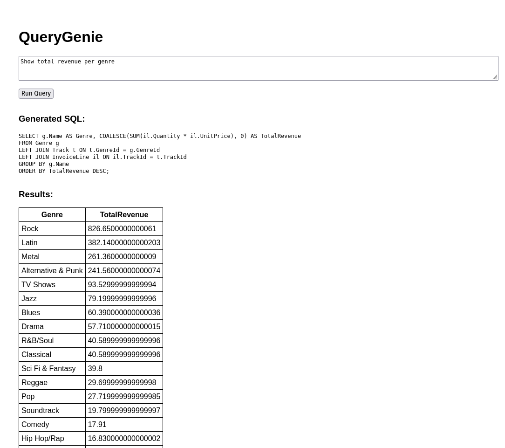

# 🧠 QueryGenie — Natural Language to SQL Translator (FastAPI + React)

QueryGenie is a fast proof-of-concept full-stack AI application that converts natural language into SQL and runs it against a real SQLite database. It demonstrates AI engineering, backend orchestration, frontend integration, and real cloud deployment.

🚀 **Live Demo:**  
https://query-genie.netlify.app

Backend API:  
https://query-genie.onrender.com/docs

---

## ✨ Highlights

- Natural language → SQL translation using OpenAI
- Executes real SQL queries (no hard-coded logic)
- Uses live database schema introspection
- Fully deployed with separate Dev / Prod environments

---

## 🧰 Tech Stack

**Backend:** FastAPI, Python, SQLite, OpenAI Responses API  
**Frontend:** React + Vite  
**Cloud:** Render (API) + Netlify (UI)

---

## 💡 Why this project?

This is a **quick proof of concept** to show:

- Applied AI Engineering
- Backend + DB + LLM integration
- Production deployment skills
- Full-stack architecture

It solves a meaningful workflow:
**query a database without writing SQL.**

---

## 🧠 Example

> Show total revenue per genre

The system generates SQL (not hardcoded) and returns real rows from the database.

---

## 📌 What this showcases

✔ AI engineering & prompt design  
✔ Frontend ↔ Backend communication  
✔ Production hosting setup  
✔ Rapid prototyping and iteration

---

Interested in the architecture or code?  
Check out the demo or send a message 😊
